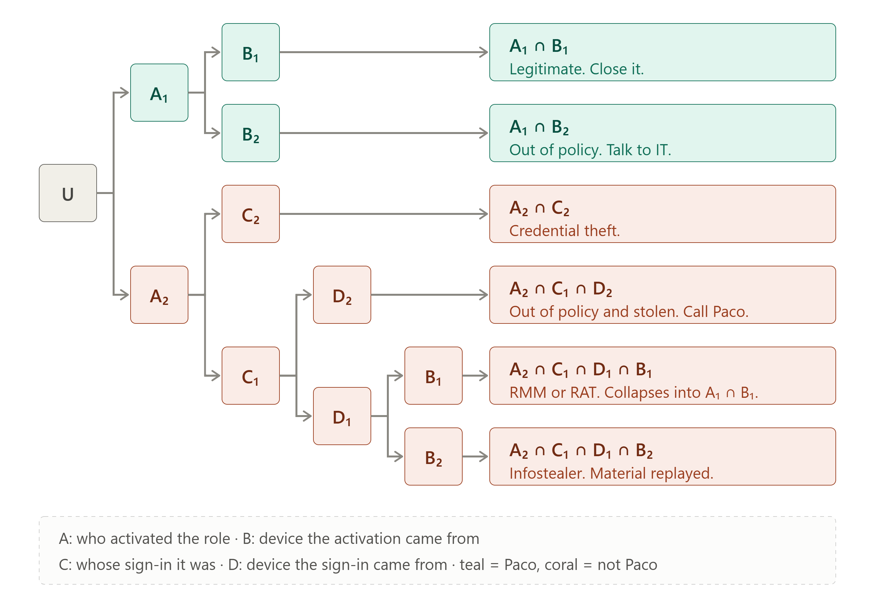

Writing reliable playbooks to guide the analysts who investigate alerts has always mattered. But when that investigation is automated with AI, it matters more than ever. A human analyst quietly compensates for the playbook's deficiencies, and even points them out so they can be fixed. They also get it wrong sometimes, of course, but the damage is local: just one or a few misclassified alerts. If that bad instruction is given to an automation, the error will propagate to every single alert, with nobody there to raise a hand about it.

I'm not saying we shouldn't automate. My point is that we should do our homework before creating a disaster, and writing reliable playbooks is part of it.

**One of the difficulties I've always had when defining an investigation playbook is "predicting" the possible outcomes of a use case before seeing hundreds of alerts. That's what this post is about.**

## The request

A former manager asked me once to write playbooks for our L1 investigations. He wanted the best possible investigation quality in every situation, so he asked for a playbook covering EVERY possible outcome of the use case. That way our L1 analysts would always know exactly what to do.

Anyone who has ever investigated an alert can see the problem. How am I supposed to think of all the possibilities beforehand, when sometimes the real reason for the alert has surprised me?

So I thought — *well, managers.* I'll cover the situations that come to mind now and add more when they happen.

## How I used to write playbooks

**My first approach was to enumerate verifications.** Check the source IP, check the user agent, check whether the device is managed. (They look obvious, but it would surprise you how lost some L1 analysts are without them.)

**If I was feeling inspired I would also add the likely scenarios**: the employee just installed a VPN, the device has an infostealer, the lucky employee is on holiday in some exotic (and therefore unusual) country.

The drawbacks are so obvious that I'm surprised I didn't think harder about them at the time. And yet most playbooks are written in a similar way.

With the first approach you end up with an analyst who has run every check and still has no idea what is going on. So they reset the password just in case and escalate.

The second approach is better. If the playbook is well written, the checks lead to an outcome the analyst can act on: asking the employee to remove a VPN from a corporate device, reimaging the machine, wishing them a happy holiday. **But it still has the same problem. How do you predict every possible outcome?**

## Stealing from consulting

I had just read [*Range*](https://www.goodreads.com/book/show/44803159), by David Epstein, and I was struck by how often people solve long-standing problems in their field by taking an idea from a completely unrelated one. Then I came across MECE, a principle from management consulting or some similarly boring grown-up stuff, and thought: I need to steal this.

MECE stands for mutually exclusive, collectively exhaustive. **Split your problem into subsets that don't overlap and that together cover everything.**

That fits our problem perfectly. We split our space of all possible outcomes for a particular use case in different outcome subsets, each one with its corresponding closure reason and remediation action (if needed). Mutual exclusivity means that our closure and remediation will be well-defined: incident or false positive, reset the password or don't. Collective exhaustiveness gives us the completeness I was after.

So I only had to learn how to build one. I watched a bunch of videos on YouTube and ended up disappointed. All of them were just brainstorming outcomes until the categories _felt_ complete. Back to square one. (To be fair, I gave up quickly, so probably there is valuable content out there.)

## Building instead of enumerating

The original request was that the categories must cover every possible outcome, and the only way I could think of was **to split everything into opposing sides. That covers the whole space by definition.** The device is corporate, or the device is not corporate. There is no third option, as long as "corporate device" is well defined.

And it doesn't stop there. Take a second property, unrelated to the first, and intersect it with the first one. Now you have four scenarios and they are still complete.

That is the property that matters here. You can keep adding dimensions and the categories stay exhaustive, not because you were careful but because complements work that way, by definition. What a relief.

## Why this works (skip it if you trust me)

Let $U$ be the universe of events: every possible outcome of the alert.

Take a property $A \subseteq U$. Its complement $A^c = U \setminus A$ satisfies $A \cup A^c = U$ and $A \cap A^c = \emptyset$, so $\{A, A^c\}$ is a partition of $U$. By definition.

Now take a second property $B \subseteq U$. $\{B, B^c\}$ is another partition of $U$.

**Exhaustiveness.** Distribute:

$$U = (A \cup A^c) \cap (B \cup B^c) = (A \cap B) \cup (A \cap B^c) \cup (A^c \cap B) \cup (A^c \cap B^c)$$

The four intersections reconstruct $U$.

**Mutual exclusivity.** Take two different blocks. They must differ in at least one factor — say one sits inside $A$ and the other inside $A^c$ (the argument is the same if they differ in $B$). Since $A \cap A^c = \emptyset$, the two blocks share no events. Any two distinct blocks are disjoint. $\blacksquare$

Add a third property and each block partitions into two. Still a partition of $U$, same argument. Iterate as many times as the problem needs.

## An example

Let's say we have a use case that fires when someone activates the Global Administrator role in Entra ID. An alert related to the user Paco was just received. What could have happened? Remember, we want to cover every single possibility.

Two assumptions first, because we need to first define our universe. One, an activation of the role took place. Two, there was a sign-in from that user before the activation.

The properties and partitions defined below are just an example, and may not fit every environment. The idea is to illustrate the process; the actual partitions should be tailored to the telemetry and priorities of each organization.

Now the properties, each with its complement:

- **A₁** Paco activated the role / **A₂** somebody else did
- **B₁** the activation came from a corporate device / **B₂** it didn't
- **C₁** the sign-in was Paco's / **C₂** it wasn't
- **D₁** the sign-in came from a corporate device / **D₂** it didn't

Note that when we say Paco above, we mean the actual person, not just his account. His account could have been compromised, stolen, used without his permission, etc. The only account involved here is Paco's account; the actual person using it can be Paco, or not.

And now we split:

**A₁ ∩ B₁.** Paco, corporate device. Legitimate. Just close it.

**A₁ ∩ B₂.** Paco, but from a personal device. Out of policy, because Paco shouldn't be doing this from home. There's no point going further down this branch because the closure reason and action will be the same in any case: talk to Paco and remind him that he shouldn't use such a privileged account from a non-corporate device.

**A₂ ∩ C₂.** Somebody else signed in and somebody else performed the action. Classic credential theft.

**A₂ ∩ C₁ ∩ D₁ ∩ B₁.** Paco signed in legitimately from his corporate device, and the activation came from that same device, but was performed by somebody else. So somebody is using Paco's machine: a malicious RMM, a RAT, an unlocked laptop. In practice this is almost indistinguishable from the first scenario, A₁ ∩ B₁, so with the telemetry we usually have, the two collapse into the same decision: just close it. There's no point getting paranoid about this every single time the alert fires, unless we already have other indicators (an EDR alert on that device, a remote tool installed last week, 4 a.m.).

**A₂ ∩ C₁ ∩ D₁ ∩ B₂.** Signed in legitimately from the corporate device, but the activation came from somewhere else, by someone else. Something (cookie, token, PRT, etc.) was stolen from that machine and replayed. Infostealer-like compromise.

**A₂ ∩ C₁ ∩ D₂.** The sign-in came from a non-corporate device. Out of policy and something was stolen as well. The remediation in this case will be not only reminding Paco about the corporate policy, but also starting an incident response.

One thing worth noticing here. There will be cases where it isn't possible to tell two branches apart with the available telemetry. The first branch (A₁ ∩ B₁) and A₂ ∩ C₁ ∩ D₁ ∩ B₁, for example, will look the same to the analyst. In that situation we need to assume the analyst (or the automation) stops there and treats both as equivalent — legitimate activity, in this case. It is just not the goal of this use case to detect that somebody is using the victim's machine. And we must define a clear point where the investigation stops, particularly if it is automated.

Another not so necessary (you can skip this one) but funny thing. As promised, our subsets contain all possible scenarios, even stupid ones. For example, imagine an attacker has stolen Paco's account and signs in from his attacker device (C₂ ∩ D₂). Now imagine Paco has installed an infostealer in that attacker device and he is able to steal the cookie (his own account cookie) from the attacker laptop. Paco then uses the stolen cookie in his corporate device and legitimately activates the Global Administrator role (A₁ ∩ B₁). Well this ridiculous outcome is also considered in one of our branches. It is the first one: A₁ ∩ B₁, since, by definition, this includes A₁ ∩ B₁ ∩ C₂ ∩ D₂.

**The key point: it is not that we predicted every possible outcome for the use case (that is impossible). It is that our result is just as valid either way. We defined a partition of the space of all possible outcomes, and that partition includes every single one of them. We made sure to split the branches until each one had a clear, defined closure reason and response. We don't have to think of every potential scenario, because we can guarantee that whatever happens will land in one — and only one — branch.**

## What this tells you before you write the rule

Here's the part I wasn't expecting when I started doing this.

If you build the partition and find you can't tell most of the branches apart with the telemetry you have (you can't tell whether the device is corporate, you can't tell whether the sign-in was really Paco's, etc.), then you don't have a playbook problem. You have a use case that either doesn't make sense in your environment, or needs more telemetry before it does.

Putting an analyst on an alert whose branches you can't separate is going to go badly. They'll run every check, land nowhere, reset the password just in case and escalate. Which is where we started.

**So the MECE is not only just a way of structuring the playbook, it can also be a viability test you run before writing the rule**. I was also surprised about never having thought about the viability of a use case based on the telemetry necessary for its investigation (apart from some very obvious cases). And it should be equally important as the telemetry necessary for the rule itself.

## Back to automation

The MECE is for whoever writes the playbook, not for the analyst. The analyst runs the checks in order and the category should fall out of the answers.

Which is the point I wanted to get to. **The hard part was never the automation, it's the work that must exist before it.**

As long as there are humans in the loop, writing low quality playbooks is not always a critical issue: the analyst fills the gaps with their own judgement and nobody finds out the instructions were incomplete. And if it goes wrong, we can always blame the inexperienced analyst. The moment you automate, the truth comes out. The automation will never improvise and do a better job than the instructions. Best case scenario, it will keep making the same mistakes as an analyst (it will make them faster though).
